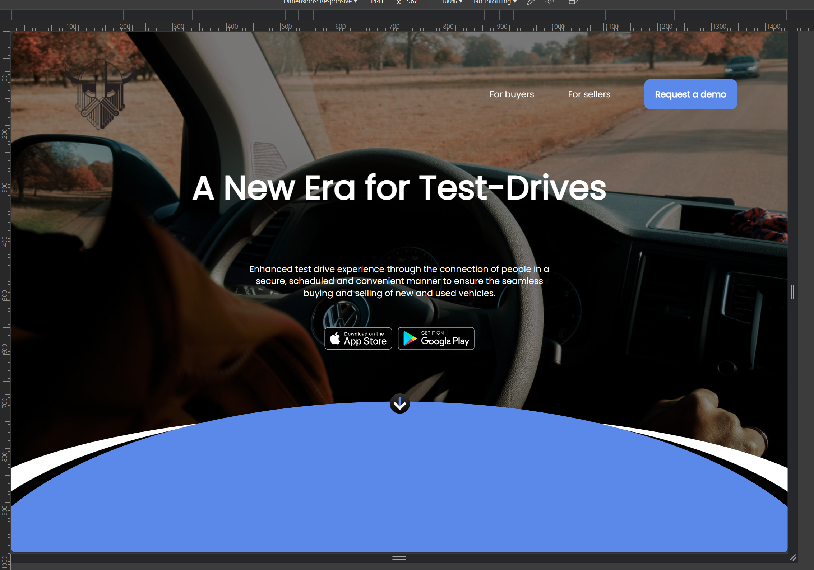

# Lucky Beard Demo

This is a  project as part of an interview process for a Front-End Engineer position at Luckybeard 



## 1) Setup & Installation

### 1.1) Clone the repository and install dependencies.

```bash
# Clone the repository
git clone https://github.com/luketurk/lucky-beard.git

# Navigate to the project directory
cd lucky-beard-demo

# Install dependencies
npm install
```

### 1.2) Run the app

```bash
npm start
```

# 2) Run Unit Tests

### 2.1) From the terminal, run the following command

```bash
npm test
```

# 3) CSS Framework
## Styled-components 

Why I chose styled-components
1) Easy to Use: Writing CSS inside JavaScript is straightforward with Styled Components, making it easy to style individual parts of my app without dealing with multiple CSS files.

2) No Style Conflicts: Each component gets its unique style, so I don't have to worry about one part of my app accidentally changing the look of another.

3) Change Styles Dynamically: It's super handy to change styles based on what's happening in the app, like switching themes or responding to user actions, all directly within the component's code.

4) Clean and Organized: With Styled Components, the styles for each part of my app are kept right where they're used. This makes it much easier to see what's going on and make changes later.

5) Great for Teams: Because everything is so modular and contained, it's easier for me and others to work on the app without stepping on each other's toes.

In short, Styled Components made styling my app more straightforward, more flexible, and less error-prone, which is why I went with it for this project.

# 4) Issues experienced, solutions put in place

## 4.1) Implementing the first 'curve' on the landing page
> When I first tried to add the curve to the homepage, it was trickier than I expected. I started with CSS's clip-path, but it didn't quite do the job. Then, I thought about using the curve as an image directly from the design files. However, incorporating the down arrow icon with this approach became problematic.

>> The solution came when I decided to merge the Down Arrow SVG with the Curve SVG into a single SVG. This approach worked well and fit seamlessly into the landing page design. To ensure everything layered correctly, I adjusted the z-index of different elements until they all aligned perfectly.
 

 ## 4.2) Dynamic form validation

 > problem: The main objectives was to ensure that the data entered by the users adhered to specific formats and that all required fields were filled out before submission, also I had to give real time feedback.

 >> I created and used a `validateInput` function which checked each input against predefined validation rules, eg regex patterns for the name, emails, and mobile numbers, and length constraints for the various fields. This function returns an error message if the validation fails, which is then displayed next to the corresponding input field.

 >> a `handleInputChange` function updates the form's state every time users interact with the form, and this invokes the `validateInput` function to check for errors.

 >> The forms validation is contingent on when `isFormValid` func which checks there are no errors and that all fields are filled. 


 ## 4.3) <Select></Select> Custom Dropdown with Rotating Chevron Icon
 > Initially, I attempted to use the standard HTML <select></select> element for the dropdown feature, but I hit a snag when trying to get the chevron icon to rotate as the dropdown opened and closed. The default just wasn't flexible enough to achieve the interactive effect I wanted.
 
 >> I decided to create a custom dropdown component. This new component allowed me to manage the selection state more dynamically and rotate the chevron icon to indicate whether the dropdown was open or closed, providing a more intuitive and visually appealing user experience. The custom dropdown gave me full control over styling, as the native <select></select> element is notoriously difficult to style 

# 5) Future Enhancements
 Given additional time and resources, here are the enhancements I would prioritize to elevate the project to the next level:
## Deploying to a Live Environment:
> One of the key steps to enhance the usability of the project is to move it from a local development environment to a live production environment. This would involve selecting a reliable hosting platform (like Vercel, Netlify, or AWS) and setting up a domain name to provide users with easy access to the application through a user-friendly URL. This step not only makes the application publicly accessible but also provides a real-world environment to test its performance, security, and user experience on a larger scale. 

## Optimizing Image Delivery:
>  To improve the application's load times and overall performance, I would implement an image optimization and delivery solution. By serving images from a Content Delivery Network (CDN) and utilizing techniques like lazy loading, compression, and responsive images, the application can significantly reduce bandwidth usage and enhance the user experience, especially on mobile devices with limited resources. Tools and services like Cloudinary or Imgix can be integrated to automate the process of optimizing and serving images based on the user's device and network conditions.


